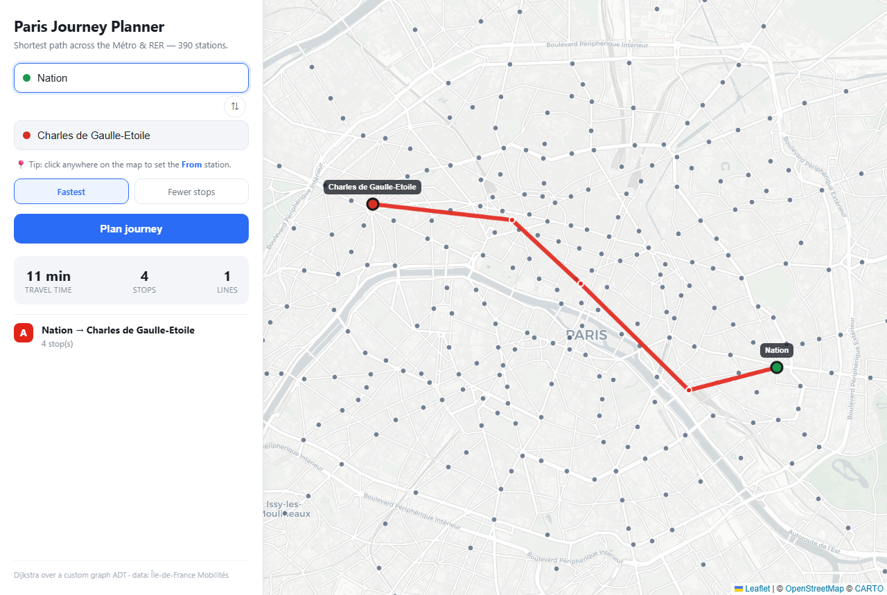
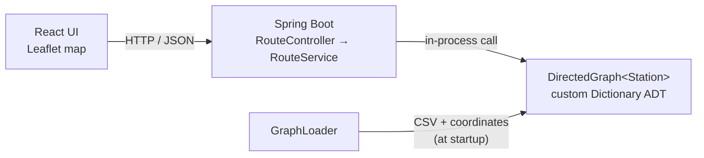

# Paris Journey Planner

An interactive shortest-path planner for the Paris **Métro & RER** network. Pick two
of 390 stations — by typing or by clicking the map — and the app computes the fastest
route (or the one with the fewest stops) and draws it, line by line, in the official
line colours.

It started life as a university **data-structures** assignment: a console program built
on a hand-written dictionary ADT and a directed graph with Dijkstra's algorithm. This
repo keeps that algorithmic core intact and grows a full-stack application around it —
a Spring Boot REST API and a React + Leaflet map UI.



---

## Features

- **Shortest path two ways** — minimise travel time (weighted Dijkstra) or number of stops.
- **Interactive map** — 390 stations rendered with [Leaflet](https://leafletjs.com/); routes drawn as line-coloured segments with transfer points highlighted.
- **Pick stations from the map** — click anywhere and the nearest station fills the active field.
- **Type-ahead search** over every station name.
- **Shareable deep links** — `/?from=Nation&to=Bastille&pref=TIME` reproduces a journey.
- **Real geodata** — station coordinates joined from the Île-de-France Mobilités open dataset (100% coverage).

## Tech stack

| Layer     | Tech |
|-----------|------|
| Core      | Java 21 — custom `Dictionary` ADT, `DirectedGraph`, Dijkstra & min-stops search |
| Backend   | Spring Boot 3.5, REST, Bean Validation, RFC 7807 error responses |
| Frontend  | React 19, Vite 5, React-Leaflet 5 |
| Data      | GTFS-style CSV + IDFM station coordinates |
| Tests     | JUnit 5 (16 tests across ADT, graph, and service layers) |
| Packaging | Multi-stage Dockerfile (single image, single port) |

## Architecture



The graph core knows nothing about HTTP or how a route is displayed. Each search keeps
its state in local maps (distance / predecessor / settled) rather than mutating the
shared graph, so the singleton instance answers concurrent requests safely and returns
an immutable `Path`. `RouteService` groups the returned stops into per-line segments —
the shape the UI draws and lists.

## Running it

### Prerequisites
- Java 21 (the backend uses the bundled Maven Wrapper — no global Maven needed)
- Node.js 20.19+ (or 22+)

### Development (two processes, hot reload)

```bash
# 1) Backend — http://localhost:8088
cd backend
./mvnw spring-boot:run -Dspring-boot.run.arguments=--server.port=8088

# 2) Frontend — http://localhost:5173 (proxies /api to the backend)
cd frontend
npm install
npm run dev
```

Open http://localhost:5173.

> The dev server proxies `/api` to `http://localhost:8088` (configurable via
> `VITE_API_TARGET`), so the browser only ever makes same-origin calls.

### Production / Docker (one container)

The frontend is compiled and served as static files by Spring Boot, so the whole app
is a single image on a single port. Requires a running Docker daemon (e.g. Docker Desktop).

```bash
docker build -t paris-journey-planner .
docker run -p 8080:8080 paris-journey-planner
# open http://localhost:8080
```

## API

### `GET /api/stations?q=<substring>`
Lists stations (optionally filtered) for the autocomplete.
```json
[{ "name": "Bastille", "latitude": 48.852962, "longitude": 2.368975 }]
```

### `POST /api/route`
```json
{ "origin": "Nation", "destination": "Bastille", "preference": "TIME" }
```
`preference` is `TIME` (fastest) or `STOPS` (fewest stops). Response:
```json
{
  "origin": "Nation",
  "destination": "Bastille",
  "preference": "TIME",
  "totalSeconds": 240.0,
  "totalStops": 2,
  "segments": [
    { "line": "A", "walking": false, "stations": [ /* {name, latitude, longitude} ... */ ] },
    { "line": "1", "walking": false, "stations": [ /* ... */ ] }
  ]
}
```
Errors use RFC 7807 problem responses: `404` (unknown station), `422` (no route), `400` (bad request).

## Project layout

```
backend/        Spring Boot app — graph core, services, REST API, tests
frontend/       React + Leaflet single-page app
tools/          match_coords.py — joins station names to IDFM coordinates
docs/           screenshots
legacy/         the original console-only coursework version, kept for reference
```

## Tests

```bash
cd backend && ./mvnw test
```

## Data & credits

- Network/timetable data: GTFS-style export of the Paris Métro & RER.
- Station coordinates: [Île-de-France Mobilités open data](https://data.iledefrance-mobilites.fr/) — "emplacement des gares", joined by station name.
